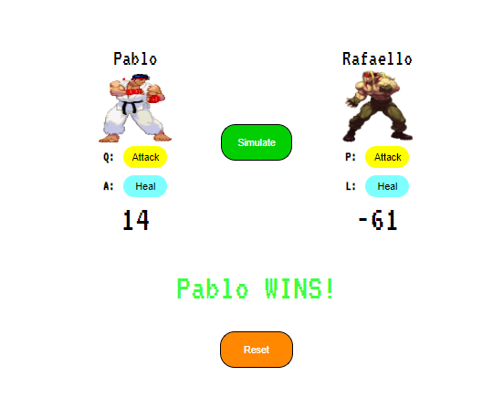

# Fighting Game
A tekken like fighting game using vanilla JS

## Table of contents
* [Technologies](#technologies)
* [Functionalities](#functionalities)
* [Screens](#screens)
* [Live](#live-star2)

## Technologies
Project was created with:
* HTML5
* CSS3
* JavaScript

## Functionalities
In project You are able to:
* fight between two players using Q for attack and A for heal as player 1 and P for attack and L for heal as player 2 (**only on desktop version!**),
* see Your health points,
* reset the fight,
* simulate the fight.

## Screens   

 

## Live :star2:
https://zasada94.github.io/fightinggame/
